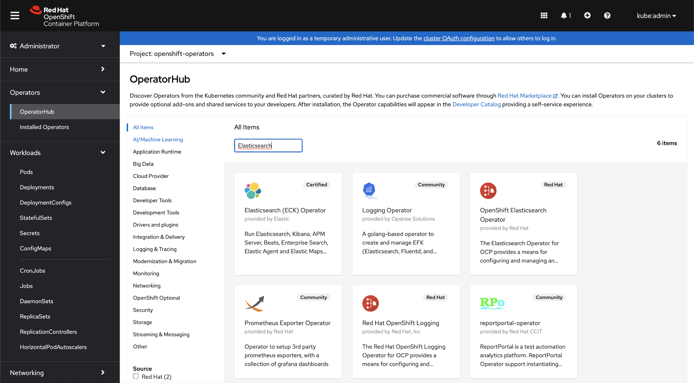
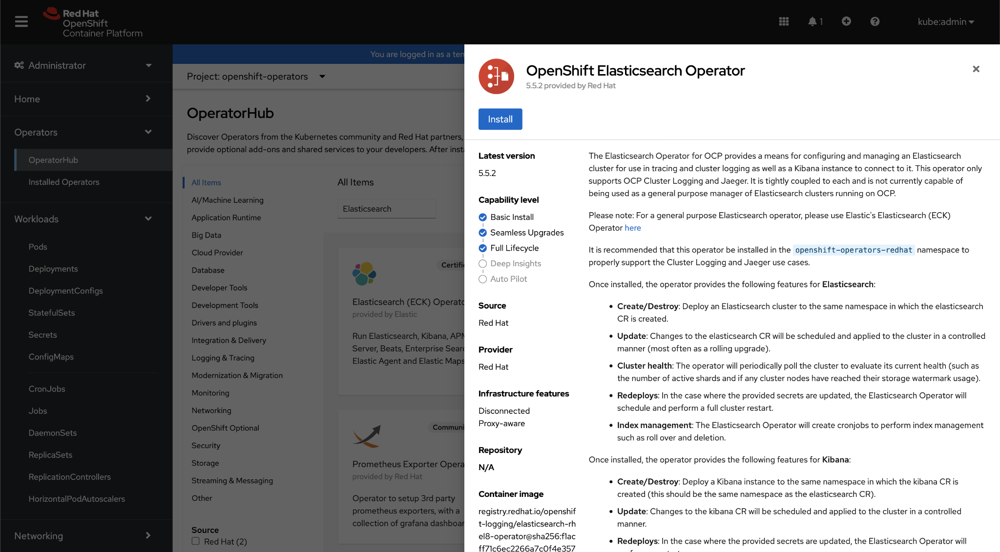
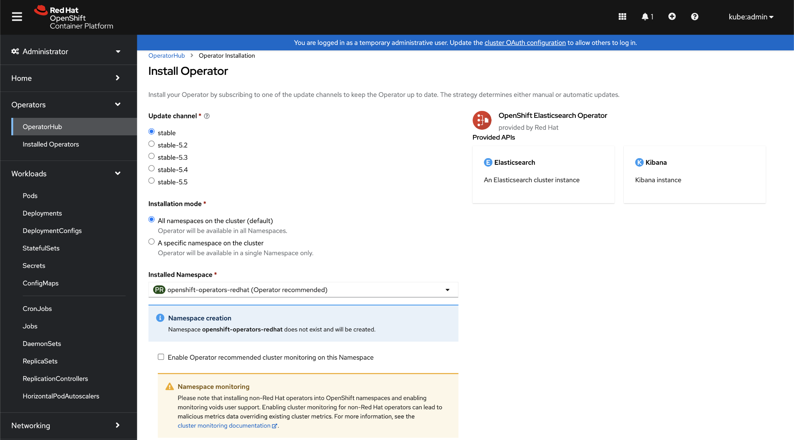

# Operator Installation. 

### What are Red Hat OpenShift Operators?

Operators and Red Hat OpenShift Container Platform

Red Hat® OpenShift® Operators automate the creation, configuration, and management of instances of Kubernetes-native applications. Operators provide automation at every level of the stack—from managing the parts that make up the platform all the way to applications that are provided as a managed service.

Red Hat OpenShift uses the power of Operators to run the entire platform in an autonomous fashion while exposing configuration natively through Kubernetes objects, allowing for quick installation and frequent, robust updates. In addition to the automation advantages of Operators for managing the platform, Red Hat OpenShift makes it easier to find, install, and manage Operators running on your clusters.

Included in Red Hat OpenShift is the Embedded OperatorHub, a registry of certified Operators from software vendors and open source projects. Within the Embedded OperatorHub you can browse and install a library of Operators that have been verified to work with Red Hat OpenShift and that have been packaged for easy lifecycle management.

### Summary of Terms

The tables below briefly summarize the cluster resources and components associated with operators and the OpenShift Operator Framework we will further elaborate on in this article.

|**Cluster Resources**| **Description** | 
|------------|-----------------|
|Custom Resource Definition (CRD)  |The CRD is a file in the operator and defines an extension to the Kubernetes API. |
|Cluster Service Version (CSV) |A CSV represents a version of an operator in the cluster.  |
|Install Plan (IP)  |An Install Plan is a list of resources to be created when installing or updating a CSV.  |

|**Operator Framework Component**	| **Description** | 
|------------|-----------------|
|Operator  |Software makes it easier to manage the lifecycle of applications within a cluster. |
|OperatorHub |A curated collection of operators available to install on a cluster.  |
|Operator Registry |An application that provides operator metadata, custom resource definitions (CRDs), and cluster service versions (CSVs) to the OLM.  |
|Operator LifeCycle Manager (OLM)	|Manages the operator lifecycle, i.e., the installation, updates, and RBAC access for the operator.|
|||

### How to install an OpenShift Operator from the OpenShift Console

In this section, we will explain how to install an operator from the OperatorHub in the OpenShift web console. Installing an operator via the web console is the easiest way to add software and extend the power of your OpenShift cluster. 

**For our example, we will install the ElasticSearch operator RedHat provides**. 

Please note this operator is meant to be integrated with other Red Hat operators and services. In our case, installing this operator is simply for demo purposes. Our demo only covers installing the operator. Each operator will have application-specific configurations that are outside of the scope of this article. 

**Step 1** - Select Operators on the left-hand menu from the web console and click on Operator Hub. Search for ElasticSearch and select the OpenShift ElasticSearch Operator

**Step 2** - There will be a preview screen where you can see some of the details for the operator. This page will often provide details of the operator software. Once you have read the information, click “Install.”

**Step 3** - On the next screen is the option to choose the channel (subscription), installation mode (automatic or manual), and the installed namespace. Unless you have other specific requirements, the default openshift-operators-redhat is a suitable namespace. 

Once the installation is complete, click on View Operator to see the installation results. Uninstalling an operator is as simple as selecting “Actions” and “Uninstall Operator.”

## Conclusion

OpenShift Operators play a vital role in OpenShift clusters. Their power lies in being able to integrate and extend the capabilities of the cluster as well as automatically manage software installation and updates.

